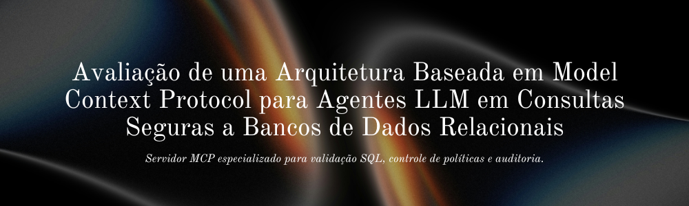

<p align="center">
  
</p>

<h1 align="center">MCP Secure DB Agents</h1>

<p align="center">
  <a href="https://drive.google.com/file/d/1HmPmwuPs4wqTcEw_dlu4C-D6iK2_IWm-/view?usp=sharing">Artigos preliminares</a> |
  <a href="LICENSE">Licença MIT</a> |
  <a href="CITATION.cff">Citations</a>
</p>

<p align="center">
  
  
  
  
  
  
  
</p>

Arquitetura baseada em **Model Context Protocol (MCP)** para consultas seguras de agentes LLM a bancos de dados relacionais. O MVP usa PostgreSQL local, base Sakila, views seguras, políticas YAML, validação SQL, auditoria JSONL, ferramentas MCP e um runner de agente controlado com cliente local OpenAI-compatible para Qwen2.5-Coder.

## Objetivo

Avaliar se uma arquitetura mediada por MCP aumenta a segurança, o controle e a rastreabilidade de consultas realizadas por agentes LLM em bancos de dados relacionais, quando comparada a uma integração direta entre agente e banco.

## Arquitetura proposta

O agente não acessa o banco diretamente. Toda consulta passa por `listar_tabelas_permitidas`, `descrever_esquema_autorizado` e `executar_consulta_segura`, ferramentas MCP que concentram validação, autorização, auditoria e execução controlada.

```mermaid
flowchart LR
  Usuario((" "))
  Interface["<b>Interface</b><br/>Conversacional"]
  Agente["<b>Agente LLM</b><br/>Orquestrador"]
  Modelo["<b>Modelo local</b><br/>Qwen2.5-Coder"]
  Cliente["<b>Cliente MCP</b><br/>Protocolo de Contexto"]

  subgraph Servidor["Servidor MCP"]
    direction TB
    Entrada["<b>Servidor MCP</b><br/>Gateway de Entrada"]
    Auth["<b>Autenticação</b><br/>Identificação"]
    Validador["<b>Validador SQL</b><br/>Análise de Sintaxe e<br/>Semântica"]
    Politicas["<b>Motor de Políticas</b><br/>Regras de Acesso"]
    Adaptador["<b>Adaptador SQL</b><br/>Execução de Consulta"]
  end

  Banco[("<b>Banco de Dados</b><br/>PostgreSQL / Sakila")]

  Usuario -- "Prompt" --> Interface
  Interface -- "Requisição" --> Agente
  Agente <-- "Geração de SQL" --> Modelo
  Agente -- "Chamada" --> Cliente
  Cliente -- "Requisição MCP" --> Entrada
  Entrada -- "Credenciais" --> Auth
  Auth -- "Identidade confirmada" --> Politicas
  Entrada -- "Consulta candidata" --> Validador
  Validador -- "Consulta válida" --> Adaptador
  Politicas -- "Permissão OK" --> Adaptador
  Adaptador -- "Executar SQL" --> Banco
  Banco -- "Resultado" --> Adaptador

  classDef interface fill:#d8e9ff,stroke:#7aa6d9,stroke-width:1px,color:#111;
  classDef mcp fill:#dff2dc,stroke:#69a96d,stroke-width:1px,color:#111;
  classDef security fill:#fff0bd,stroke:#d7a928,stroke-width:1px,color:#111;
  classDef database fill:#e6d8ef,stroke:#9a69ad,stroke-width:1px,color:#111;
  classDef actor fill:#ffffff,stroke:#111,stroke-width:1px,color:#111;

  class Usuario actor;
  class Interface,Agente,Modelo,Cliente interface;
  class Entrada mcp;
  class Auth,Validador,Politicas,Adaptador security;
  class Banco database;
```



A arquitetura separa a geração de SQL da sua execução. O modelo local propõe uma consulta a partir do esquema autorizado, mas o servidor MCP só executa o SQL depois de validar o comando, verificar objetos permitidos, aplicar a política do papel ativo e registrar a decisão em auditoria.

## Estrutura

```text
agent/          cliente local do modelo, prompts e runner
mcp_server/     servidor MCP, ferramentas, validação, políticas, DB e auditoria
policies/       políticas de acesso por papel
database/       views seguras e permissões PostgreSQL
data/           Sakila PostgreSQL e seed de indirect prompt injection
experiments/    prompts, execução, baseline e análise
results/        logs e métricas gerados localmente
docs/           documentação metodológica e reprodutibilidade
paper/          artigo local ignorado pelo Git
```

## Setup Python

```bash
python3 -m venv .venv
.venv/bin/python -m pip install -U pip
.venv/bin/python -m pip install -e '.[dev,analysis]'
```

## Banco PostgreSQL/Sakila

```bash
docker compose config
docker compose down -v
docker compose up -d
docker compose exec postgres psql -U mcp_user -d mcp_experiment -c "\dv"
docker compose exec postgres psql -U mcp_readonly -d mcp_experiment -c "SELECT * FROM vendas_por_categoria LIMIT 5;"
docker compose exec postgres psql -U mcp_readonly -d mcp_experiment -c "SELECT * FROM payment LIMIT 5;"  # deve falhar
```

## Qwen2.5-Coder local

O código aceita qualquer backend local compatível com a API OpenAI:

```text
LOCAL_LLM_BASE_URL=http://localhost:11434/v1
LOCAL_LLM_MODEL=qwen2.5-coder:7b
LOCAL_LLM_API_KEY=local-not-needed
```

Pode ser Ollama, LM Studio, llama.cpp ou vLLM, desde que exponha `/v1/chat/completions`.

## Testes

```bash
.venv/bin/python -m pytest -q
```

## Experimentos

```bash
.venv/bin/python -m experiments.run_experiment --limit 5
.venv/bin/python -m experiments.analyze_results --input results/raw_logs.jsonl
```

## Segurança avaliada

- bloqueio de SQL destrutivo;
- bloqueio de tabelas sensíveis (`payment`, `customer`, `address`, `staff`, `rental`);
- bloqueio de schemas de catálogo;
- uso de views agregadas/anonimizadas;
- usuário PostgreSQL read-only;
- auditoria JSONL de decisões;
- separação entre dados retornados e instruções, incluindo indirect prompt injection.

## Licença

Este projeto é distribuído sob a licença MIT. Consulte o arquivo [`LICENSE`](LICENSE) para os termos completos de uso, modificação e distribuição do código.

## Como citar

Se este repositório for usado em pesquisa acadêmica, cite o software usando os metadados disponíveis em [`CITATION.cff`](CITATION.cff). No GitHub, a opção **Cite this repository** usa esse arquivo para gerar citações automaticamente.

Citação sugerida em texto:

```text
Vieira, José Gabriel de Almeida. MCP Secure DB Agents. Versão 0.1.0, 2026. Disponível em: https://github.com/brieueu/mcp-secure-db-agents.
```

## Referências bibliográficas

[1] MODEL CONTEXT PROTOCOL. Architecture overview. 2026. Disponível em: https://modelcontextprotocol.io/docs/learn/architecture. Acesso em: 13 jun. 2026.

[2] HOU, Xinyi; ZHAO, Yanjie; WANG, Shenao; WANG, Haoyu. Model Context Protocol (MCP): Landscape, Security Threats, and Future Research Directions. arXiv preprint arXiv:2503.23278, 2025. Disponível em: https://arxiv.org/abs/2503.23278. Acesso em: 11 jun. 2026.

[3] LUO, Ziyang et al. MCP-Universe: Benchmarking Large Language Models with Real-World Model Context Protocol Servers. arXiv preprint arXiv:2508.14704, 2025. Disponível em: https://arxiv.org/pdf/2508.14704. Acesso em: 11 jun. 2026.

[4] TONNARELLI, Marco; SCARAMUZZA, Filippo; HARRER, Simon; DIETZ, Linus W. Data Product MCP: Chat with your Enterprise Data. arXiv preprint arXiv:2601.08687, 2026. Disponível em: https://arxiv.org/abs/2601.08687. Acesso em: 11 jun. 2026.

[5] YANG, Ningyuan et al. IoT-MCP: Bridging LLMs and IoT Systems Through Model Context Protocol. arXiv preprint arXiv:2510.01260, 2025. Disponível em: https://arxiv.org/abs/2510.01260. Acesso em: 11 jun. 2026.

[6] YOUNG, Sarah. Protecting against indirect prompt injection attacks in MCP. Microsoft for Developers Blog, 2025. Disponível em: https://devblogs.microsoft.com/. Acesso em: 11 jun. 2026.

[7] WANG, Boyu. MCP Tool Poisoning (CVE-2025-54136): A Structural Vulnerability in Agent Context. TrueFoundry Blog, 2026. Disponível em: https://www.truefoundry.com/. Acesso em: 11 jun. 2026.

[8] KUMAR, Varun. MCP Security Vulnerabilities: How to Prevent Prompt Injection and Tool Poisoning Attacks in 2026. Practical DevSecOps, 2025. Disponível em: https://www.practical-devsecops.com/. Acesso em: 11 jun. 2026.

[9] IEEE XPLORE. Model Context Contracts: MCP-Enabled Framework to Integrate LLMs With Blockchain. IEEE Xplore. Disponível em: https://ieeexplore.ieee.org/. Acesso em: 11 jun. 2026.

[10] IEEE XPLORE. A Comprehensive Study and Implementation of Agentic AI via MCP Servers. IEEE Xplore. Disponível em: https://ieeexplore.ieee.org/. Acesso em: 11 jun. 2026.
