# MCP Secure DB Agents

Arquitetura baseada em **Model Context Protocol (MCP)** para consultas seguras de agentes LLM a bancos de dados relacionais. O MVP usa PostgreSQL local, base Sakila, views seguras, políticas YAML, validação SQL, auditoria JSONL, ferramentas MCP e um runner de agente controlado com cliente local OpenAI-compatible para Qwen2.5-Coder.

## Objetivo

Avaliar se uma arquitetura mediada por MCP aumenta a segurança, o controle e a rastreabilidade de consultas realizadas por agentes LLM em bancos de dados relacionais, quando comparada a uma integração direta entre agente e banco.

## Arquitetura proposta

O agente não acessa o banco diretamente. Toda consulta passa por `listar_tabelas_permitidas`, `descrever_esquema_autorizado` e `executar_consulta_segura`, ferramentas MCP que concentram validação, autorização, auditoria e execução controlada.

```mermaid
flowchart LR
  Usuario((" "))
  Interface["<b>Interface</b><br/>Conversacional"]
  Agente["<b>Agente LLM</b><br/>Orquestrador"]
  Modelo["<b>Modelo local</b><br/>Qwen2.5-Coder"]
  Cliente["<b>Cliente MCP</b><br/>Protocolo de Contexto"]

  subgraph Servidor["Servidor MCP"]
    direction TB
    Entrada["<b>Servidor MCP</b><br/>Gateway de Entrada"]
    Auth["<b>Autenticação</b><br/>Identificação"]
    Validador["<b>Validador SQL</b><br/>Análise de Sintaxe e<br/>Semântica"]
    Politicas["<b>Motor de Políticas</b><br/>Regras de Acesso"]
    Adaptador["<b>Adaptador SQL</b><br/>Execução de Consulta"]
  end

  Banco[("<b>Banco de Dados</b><br/>PostgreSQL / Sakila")]

  Usuario -- "Prompt" --> Interface
  Interface -- "Requisição" --> Agente
  Agente <-- "Geração de SQL" --> Modelo
  Agente -- "Chamada" --> Cliente
  Cliente -- "Requisição MCP" --> Entrada
  Entrada -- "Credenciais" --> Auth
  Auth -- "Identidade confirmada" --> Politicas
  Entrada -- "Consulta candidata" --> Validador
  Validador -- "Consulta válida" --> Adaptador
  Politicas -- "Permissão OK" --> Adaptador
  Adaptador -- "Executar SQL" --> Banco
  Banco -- "Resultado" --> Adaptador

  classDef interface fill:#d8e9ff,stroke:#7aa6d9,stroke-width:1px,color:#111;
  classDef mcp fill:#dff2dc,stroke:#69a96d,stroke-width:1px,color:#111;
  classDef security fill:#fff0bd,stroke:#d7a928,stroke-width:1px,color:#111;
  classDef database fill:#e6d8ef,stroke:#9a69ad,stroke-width:1px,color:#111;
  classDef actor fill:#ffffff,stroke:#111,stroke-width:1px,color:#111;

  class Usuario actor;
  class Interface,Agente,Modelo,Cliente interface;
  class Entrada mcp;
  class Auth,Validador,Politicas,Adaptador security;
  class Banco database;
```



A arquitetura separa a geração de SQL da sua execução. O modelo local propõe uma consulta a partir do esquema autorizado, mas o servidor MCP só executa o SQL depois de validar o comando, verificar objetos permitidos, aplicar a política do papel ativo e registrar a decisão em auditoria.

## Estrutura

```text
agent/          cliente local do modelo, prompts e runner
mcp_server/     servidor MCP, ferramentas, validação, políticas, DB e auditoria
policies/       políticas de acesso por papel
database/       views seguras e permissões PostgreSQL
data/           Sakila PostgreSQL e seed de indirect prompt injection
experiments/    prompts, execução, baseline e análise
results/        logs e métricas gerados localmente
docs/           documentação metodológica e reprodutibilidade
paper/          artigo local ignorado pelo Git
```

## Setup Python

```bash
python3 -m venv .venv
.venv/bin/python -m pip install -U pip
.venv/bin/python -m pip install -e '.[dev,analysis]'
```

## Banco PostgreSQL/Sakila

```bash
docker compose config
docker compose down -v
docker compose up -d
docker compose exec postgres psql -U mcp_user -d mcp_experiment -c "\dv"
docker compose exec postgres psql -U mcp_readonly -d mcp_experiment -c "SELECT * FROM vendas_por_categoria LIMIT 5;"
docker compose exec postgres psql -U mcp_readonly -d mcp_experiment -c "SELECT * FROM payment LIMIT 5;"  # deve falhar
```

## Qwen2.5-Coder local

O código aceita qualquer backend local compatível com a API OpenAI:

```text
LOCAL_LLM_BASE_URL=http://localhost:11434/v1
LOCAL_LLM_MODEL=qwen2.5-coder:7b
LOCAL_LLM_API_KEY=local-not-needed
```

Pode ser Ollama, LM Studio, llama.cpp ou vLLM, desde que exponha `/v1/chat/completions`.

## Testes

```bash
.venv/bin/python -m pytest -q
```

## Experimentos

```bash
.venv/bin/python -m experiments.run_experiment --limit 5
.venv/bin/python -m experiments.analyze_results --input results/raw_logs.jsonl
```

## Segurança avaliada

- bloqueio de SQL destrutivo;
- bloqueio de tabelas sensíveis (`payment`, `customer`, `address`, `staff`, `rental`);
- bloqueio de schemas de catálogo;
- uso de views agregadas/anonimizadas;
- usuário PostgreSQL read-only;
- auditoria JSONL de decisões;
- separação entre dados retornados e instruções, incluindo indirect prompt injection.
