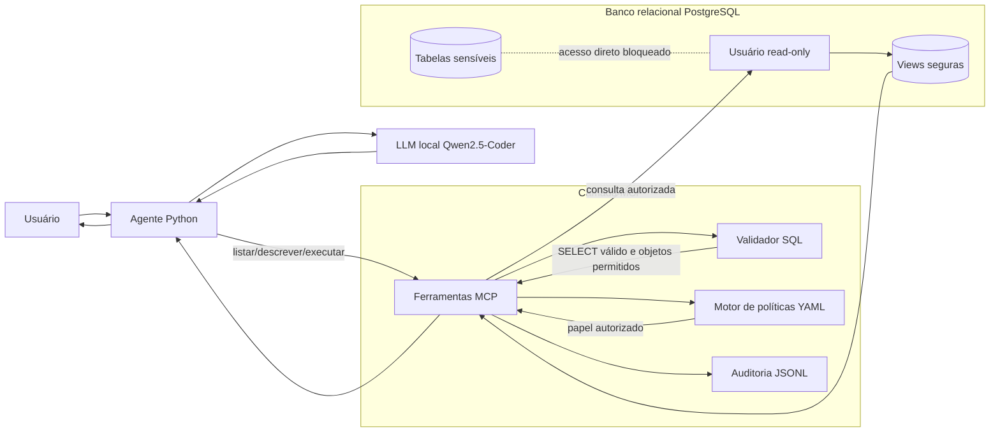
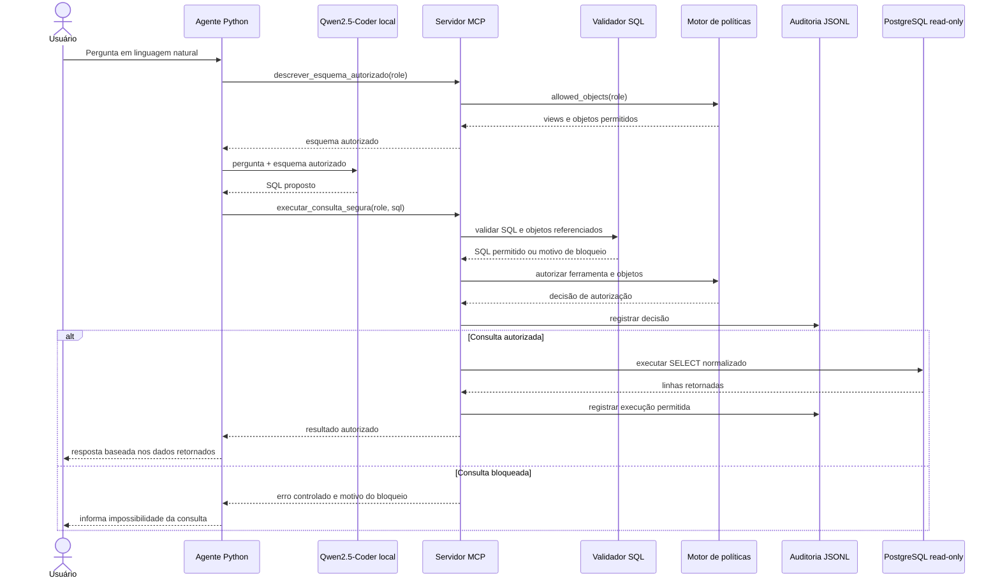

# Arquitetura proposta para consultas seguras a bancos relacionais mediadas por MCP

A arquitetura proposta separa a geração da intenção de consulta, a mediação por ferramentas, a autorização, a validação SQL, a execução no banco e a auditoria. O agente LLM não recebe credenciais diretas do PostgreSQL e não executa consultas por conta própria. Toda interação com o banco relacional passa por um servidor MCP, que expõe apenas ferramentas controladas e aplica políticas antes de permitir qualquer acesso aos dados.

## Visão geral

## Componentes

1. Usuário
   - Formula perguntas em linguagem natural sobre os dados disponíveis.
   - Não interage diretamente com o banco nem com credenciais de conexão.

2. Agente Python
   - Recebe a pergunta do usuário.
   - Solicita ao servidor MCP o esquema autorizado para o papel ativo.
   - Envia ao modelo local apenas o contexto permitido.
   - Extrai a consulta SQL proposta pelo modelo e a submete à ferramenta segura.

3. Modelo local Qwen2.5-Coder
   - Gera uma proposta de consulta SQL a partir da pergunta e do esquema autorizado.
   - Não possui acesso direto ao banco de dados.
   - Sua saída é tratada como uma sugestão não confiável, sujeita a validação e autorização.

4. Servidor MCP
   - Atua como camada de mediação entre o agente e o banco relacional.
   - Expõe ferramentas de acesso controlado, como:
     - `listar_tabelas_permitidas`;
     - `descrever_esquema_autorizado`;
     - `executar_consulta_segura`.
   - Centraliza as regras de segurança antes da execução de consultas.

5. Validador SQL
   - Aceita apenas consultas do tipo `SELECT`.
   - Bloqueia comandos destrutivos ou administrativos, como `DROP`, `DELETE`, `UPDATE`, `INSERT`, `ALTER` e similares.
   - Verifica se a consulta referencia apenas objetos autorizados.
   - Rejeita referências a tabelas sensíveis ou objetos de catálogo quando não permitidos.

6. Motor de políticas
   - Carrega políticas declarativas em YAML.
   - Associa cada papel a ferramentas, views e objetos proibidos.
   - Decide se o papel ativo pode executar a operação solicitada sobre os objetos identificados.

7. Auditoria
   - Registra decisões de permissão ou bloqueio em logs JSONL.
   - Mantém rastreabilidade sobre papel, ferramenta, SQL, tabelas envolvidas, motivo da decisão e quantidade de linhas retornadas quando aplicável.

8. PostgreSQL com usuário read-only
   - Executa somente consultas autorizadas pela camada MCP.
   - Usa views seguras e agregadas para reduzir exposição de dados sensíveis.
   - Mantém tabelas brutas sensíveis inacessíveis ao fluxo do agente.

## Fluxo de execução de uma consulta

## Princípios de segurança

- Mediação obrigatória: o agente não acessa o banco diretamente; toda operação passa por ferramentas MCP.
- Menor privilégio: a conexão com o PostgreSQL usa usuário read-only e opera sobre views seguras.
- Defesa em profundidade: políticas YAML, validação SQL, objetos permitidos, objetos proibidos e permissões do banco atuam em camadas.
- Separação de responsabilidades: o modelo gera intenção, o agente orquestra, o MCP valida e autoriza, e o banco apenas executa consultas já aprovadas.
- Rastreabilidade: cada decisão relevante é registrada para posterior auditoria e análise experimental.
- Mitigação de prompt injection indireto: dados retornados do banco são tratados como dados, não como instruções para alterar o comportamento do agente.

## Diferença em relação ao acesso direto ao banco

Em uma integração direta, o agente ou o modelo teria maior proximidade com credenciais, esquema bruto e execução SQL. Na arquitetura proposta, o MCP funciona como fronteira de confiança: ele limita quais ferramentas existem, quais objetos podem ser descritos, quais consultas podem ser executadas e quais decisões ficam registradas. Assim, mesmo que o modelo proponha SQL inválido, destrutivo ou direcionado a tabelas sensíveis, a consulta é bloqueada antes de chegar ao PostgreSQL.
